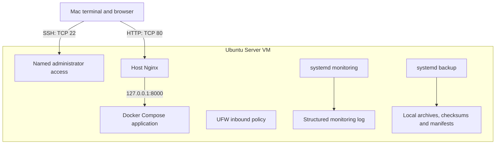

# SentinelOps

**Linux Infrastructure Automation and Monitoring Lab**

SentinelOps is a practical single-server infrastructure project that demonstrates Linux administration, secure access, networking, container deployment, monitoring, backup, recovery, failure simulation, repeatable provisioning and CI validation.

The project uses a fictional application environment so that the infrastructure lifecycle can be built, inspected, deliberately failed, recovered and explained without using production data.

## Current Status

The SentinelOps MVP implementation is substantially complete through SEN-029. SEN-030 completed the professional README and architecture decision records.

Completed implementation areas include:

- Ubuntu Server administration and secure SSH access;
- UFW firewall protection with a deny-by-default inbound policy;
- host Nginx reverse proxy;
- Docker and Docker Compose application deployment;
- private application binding on `127.0.0.1:8000`;
- application homepage and `/health` endpoint;
- structured monitoring records;
- scheduled monitoring through systemd;
- monitoring failure detection and recovery validation;
- automated local backups;
- backup manifests, checksums and retention;
- controlled restoration exercises;
- controlled failure simulations;
- repeatable and idempotent provisioning;
- GitHub Actions shell, secret, container and application validation.

SEN-031 runtime validation reproduced the environment on a fresh Ubuntu Server 24.04.4 arm64 VM using the exact SEN-030 source revision:

```text
cc6e8206d1c2ee1afa6b60b995f14b2097013e96
```

The rebuild verified clean provisioning, repeated execution, reboot persistence, security controls, scheduled monitoring, backup integrity and selected restoration exercises.

SEN-031 documentation review, pull-request CI, merge verification and repository cleanup remain separate completion gates. Final demonstration evidence and the criterion-by-criterion MVP release audit remain assigned to SEN-032.

The project is not yet declared a final MVP release.

## Project Goal

SentinelOps demonstrates how a small Linux environment can be securely configured, operated, monitored, backed up, recovered and reproduced through understandable automation.

The project prioritises manual understanding before automation. Each major change is documented with its purpose, implementation, validation method, failure mode and recovery path.

## Supported Environment

The supported provisioning baseline is Ubuntu Server 24.04 LTS with systemd.

Runtime validation has been performed on Ubuntu Server 24.04.4 LTS using arm64 virtual machines in UTM on a Mac.

The provisioner accepts amd64 and arm64 during preflight. Acceptance by preflight does not establish runtime validation on amd64.

The SEN-031 clean rebuild used:

| Resource | Configuration |
|---|---|
| Virtualisation | QEMU through UTM |
| CPU | 2 virtual cores |
| Memory | 3072 MiB |
| Virtual disk | 20 GiB |
| Operating system | Ubuntu Server 24.04.4 LTS |
| Architecture | arm64 |
| Network | UTM shared network |

## MVP Architecture

The MVP operates as one Ubuntu Server virtual machine on a local Mac. Separate disposable VMs are used for rebuild and failure validation.



Nginx is the application-facing entry point. The application backend is published only on the host loopback interface.

UFW controls the intended inbound services. Backend isolation also depends on the explicit loopback-only Docker publication.

## Network Exposure

| Port | Service | Exposure | Purpose |
|---|---|---|---|
| 22/TCP | SSH | Approved administration path | Remote administration |
| 80/TCP | Host Nginx | Approved application path | HTTP application access |
| 8000/TCP | Application backend | `127.0.0.1` only | Nginx to application traffic |
| Other inbound ports | No approved service | Denied by the intended inbound policy | Reduce attack surface |

The MVP does not require public DNS, public HTTPS, a public IP address or multi-server networking.

During SEN-031, application access from the Mac through Nginx succeeded. Direct access from the Mac to TCP 8000 timed out, while listener inspection confirmed the backend remained bound to `127.0.0.1`.

## Application

The application is intentionally small because SentinelOps is an infrastructure project.

It provides:

- a basic homepage;
- a `/health` endpoint;
- documented version information;
- source content suitable for synthetic backup and recovery exercises.

The expected health response is:

```json
{"status":"healthy","version":"0.1.0"}
```

Docker Compose builds and runs the application with the publication:

```text
127.0.0.1:8000:80
```

The configured restart policy is:

```yaml
restart: unless-stopped
```

## Monitoring

The monitoring workflow checks and records:

- Nginx service state;
- Docker service state;
- SSH service or socket state;
- Compose application state;
- application health;
- host Nginx health;
- filesystem usage;
- backup freshness;
- memory samples from `/proc/meminfo`;
- load samples from `/proc/loadavg`.

The scheduled monitoring service runs the protected root-owned script at:

```text
/usr/local/lib/sentinelops/health-check.sh
```

The timer is configured for an initial execution approximately one minute after boot and subsequent executions approximately every minute.

Results are written to:

```text
/var/log/sentinelops/health-check.log
```

Structured records contain a timestamp, check name, status, severity and message.

Memory and load records report successful collection. They do not evaluate memory or load thresholds, and load averages are not CPU utilisation percentages.

A successful monitoring service exit does not establish that every individual check passed. The structured records must also be inspected.

During SEN-031, scheduled monitoring detected a controlled Nginx outage in five seconds and recorded recovery after Nginx was restored. This met the selected test's 120-second educational target. It is not a guaranteed detection time for every failure.

## Backups and Recovery

The backup workflow uses a daily systemd timer to run the repository-managed backup script.

It creates:

- UTC timestamped compressed archives;
- archive manifests;
- SHA-256 checksums;
- restrictive artifact permissions;
- logged verification results.

The workflow applies a seven-day retention policy.

Backups are stored at:

```text
/home/emir/backups/sentinelops/
```

The backup includes five files:

- application `index.html`;
- application `Dockerfile`;
- application `compose.yaml`;
- the manual monitoring script;
- the host Nginx site configuration.

The repository supplies additional provisioning and systemd assets needed to reproduce the environment. The backup archive is not a complete host image.

The documented restoration flow is:

1. select a backup;
2. verify its checksum and archive integrity;
3. inspect the manifest and archive contents;
4. extract into a separate temporary directory;
5. restore the required data or configuration;
6. apply and verify the required ownership and permissions;
7. rebuild, restart or reload affected components where necessary;
8. verify the application and health endpoint.

SEN-031 verified isolated extraction of all five files and recovery of deliberately removed synthetic application source content. Restored content, ownership and permissions were checked, and the original source was reinstated.

A deliberately modified disposable archive failed checksum verification while the original archive remained valid.

A temporary systemd timer also triggered the deployed backup service successfully. The normal daily schedule remained configured, but its midnight trigger and missed-run catch-up were not observed during that session.

The restoration exercise did not rebuild the running container from backup or restore an entire VM.

Local backups do not protect against complete VM deletion, virtual disk loss or Mac host storage failure.

## Provisioning

The main provisioner is:

```text
provision/scripts/provision.sh
```

It validates prerequisites, installs or configures required packages, deploys application and monitoring assets, configures Nginx, installs systemd units, applies SSH and firewall configuration, starts the application, ensures an initial backup and validates the resulting services.

Before provisioning, the supported Ubuntu host must already have:

- the `emir` administrator account and group;
- `/home/emir` as the account's home directory;
- administrative sudo access;
- working public-key SSH access;
- the repository source files.

The provisioner does not create the administrator account. Console access should remain available during initial SSH and firewall configuration.

From the repository root on the Ubuntu target, validate source syntax:

```bash
bash -n provision/scripts/provision.sh
bash -n provision/monitoring/health-check.sh
bash -n provision/backup/backup-sentinelops.sh
git diff --check
```

Run provisioning:

```bash
sudo bash provision/scripts/provision.sh
```

The provisioner is designed to avoid duplicate firewall rules, duplicate group membership and unnecessary initial-backup creation during repeated execution.

Preflight rejects important invalid prerequisites with useful output and a non-zero exit status. Provisioning does not provide a complete transactional rollback.

See the [provisioning guide](provision/README.md) for requirements, execution order, validation and failure handling.

## Security Principles

SentinelOps applies:

- named administrator access with controlled privilege escalation;
- SSH public-key authentication;
- disabled direct root SSH login;
- disabled SSH password authentication after key access is verified;
- UFW deny-by-default inbound policy;
- host Nginx as the approved application entry point;
- loopback-only application backend publication;
- protected configuration ownership and permissions;
- a root-owned scheduled-monitoring script;
- restrictive monitoring-log and backup permissions;
- exclusion of real credentials and private keys from Git;
- synthetic data for failure and restoration exercises.

Docker group membership is treated as privileged access. Filesystem permission checks without sudo do not imply that an administrator with sudo or Docker access is isolated from root-equivalent capabilities.

The project does not claim production high availability, public cloud security or multi-server resilience.

## Repository Structure

| Path | Purpose |
|---|---|
| `.github/workflows/ci.yml` | GitHub Actions validation |
| `docs/phase-0/` | Charter, requirements, risks and success criteria |
| `docs/phase-1/` | Initial infrastructure implementation evidence |
| `docs/phase-2/` | Operational monitoring, backup and recovery evidence |
| `docs/phase-3/` | Controlled failure simulations |
| `docs/phase-4/` | Provisioning, CI and clean rebuild evidence |
| `docs/adr/` | Architecture decision records |
| `docs/architecture/` | Architecture and network design |
| `docs/security/` | Security baseline and threat model |
| `provision/application/` | Application source and container configuration |
| `provision/backup/` | Backup script |
| `provision/monitoring/` | Monitoring script |
| `provision/nginx/` | Host Nginx configuration |
| `provision/scripts/` | Provisioning entry point |
| `provision/ssh/` | SSH hardening configuration |
| `provision/systemd/` | Backup and monitoring services and timers |
| `provision/README.md` | Provisioning instructions and operational boundaries |

## Validation and Evidence

The repository documents:

- manual Linux and security configuration;
- Nginx and backend isolation;
- application deployment and health;
- backup creation, integrity and restoration;
- controlled application, backup and Nginx failures;
- repeatable and idempotent provisioning;
- shell validation and secret safety;
- container configuration and application CI;
- scheduled monitoring and measured failure detection;
- reboot persistence;
- clean rebuild verification from a recorded source revision.

The SEN-031 runtime evidence includes:

| Area | Recorded result |
|---|---|
| Fresh provisioning | Completed with exit code `0` |
| Repeated provisioning | Completed with exit code `0` |
| Administrator SSH | New public-key connection succeeded after hardening |
| Root SSH | Login attempt rejected |
| Application access | Expected healthy response through host Nginx |
| Backend isolation | Loopback publication verified and Mac access unsuccessful |
| Protected paths | Selected paths not writable by `emir` without sudo |
| Reboot | Services, application and scheduled monitoring resumed |
| Backup integrity | Valid archives accepted and modified disposable copy rejected |
| File restoration | Synthetic source content recovered and metadata verified |
| Scheduled backup | Existing backup service executed through a temporary timer |
| Failure detection | Scheduled Nginx failure detected in five seconds |
| Recovery monitoring | Scheduled PASS recorded after restoration |
| Final runtime state | Healthy application and no failed systemd units |

Pull-request CI, merge verification and default-branch CI are separate completion gates. CI validates repository code and the container application; it does not replace Ubuntu host runtime verification.

The [clean rebuild baseline](docs/phase-4/clean-rebuild-validation-baseline.md) records the source revision, commands, results, success-criterion mapping and test limitations.

## Development Principles

Every major infrastructure change should answer:

1. What problem does this solve?
2. Why is this technology being used?
3. What exactly is changing?
4. How can the change be verified?
5. What could fail?
6. How can the change be reversed?
7. How would the same problem be handled in a real organisation?

Evidence must distinguish configuration from observed execution, historical tests from newly performed tests, and successful individual checks from complete project acceptance.

## Remaining MVP Work

The clean rebuild and selected runtime verification exercises are documented in the SEN-031 baseline.

Remaining finalisation work includes:

- completion of SEN-031 documentation review, PR CI, merge verification and repository cleanup;
- organised screenshots and final demonstration evidence;
- the final demonstration video;
- the SEN-032 criterion-by-criterion MVP completion audit;
- resolution or explicit justification of remaining verification gaps before any final MVP release claim.

## Known Limitations

- Runtime rebuild evidence covers Ubuntu 24.04 arm64.
- External package versions and container image tags are not fully pinned.
- Backups remain on the same VM as the source files.
- Restoration evidence covers the documented file-level exercises.
- Memory and load monitoring collect samples without usage thresholds.
- Monitoring service exit status does not aggregate every health-check failure.
- Backup freshness alone does not establish that the latest backup job succeeded.
- Provisioning does not provide complete rollback after every failure.
- The MVP has a single-server availability boundary.

## Post-MVP Scope

The following are excluded from the initial MVP:

- off-host backup replication and broader disaster recovery;
- Ansible;
- Prometheus;
- Node Exporter;
- Grafana;
- Terraform;
- Kubernetes;
- AWS or multi-server infrastructure;
- public DNS and HTTPS deployment;
- automatic remediation;
- external alerting;
- application architecture expansion.

## Documentation

Planning and acceptance:

- [Project success criteria](docs/phase-0/success-criteria.md).

Architecture and security:

- [Architecture](docs/architecture/architecture.md);
- [Network design](docs/architecture/network-design.md);
- [Security baseline](docs/security/security-baseline.md);
- [Threat model](docs/security/threat-model.md);
- [Architecture decision records](docs/adr/).

Monitoring, backup and recovery:

- [Automated monitoring baseline](docs/phase-2/automated-monitoring-baseline.md);
- [Resource monitoring and logging baseline](docs/phase-2/resource-monitoring-logging-baseline.md);
- [Backup and recovery baseline](docs/phase-2/backup-recovery-baseline.md);
- [Automated backup baseline](docs/phase-2/automated-backup-baseline.md).

Controlled failure evidence:

- [Application container failure](docs/phase-3/application-container-failure-simulation.md);
- [Backup workflow failure](docs/phase-3/backup-workflow-failure-simulation.md);
- [Host Nginx failure](docs/phase-3/host-nginx-failure-simulation.md).

Provisioning and CI:

- [Repeatable provisioning baseline](docs/phase-4/repeatable-provisioning-baseline.md);
- [Provisioning idempotency baseline](docs/phase-4/provisioning-idempotency-validation-baseline.md);
- [GitHub Actions CI baseline](docs/phase-4/github-actions-ci-baseline.md);
- [Container and application CI baseline](docs/phase-4/container-application-ci-validation-baseline.md);
- [Clean rebuild validation baseline](docs/phase-4/clean-rebuild-validation-baseline.md);
- [Provisioning guide](provision/README.md).

Historical baseline documents retain the implementation and evidence context of their original issues.